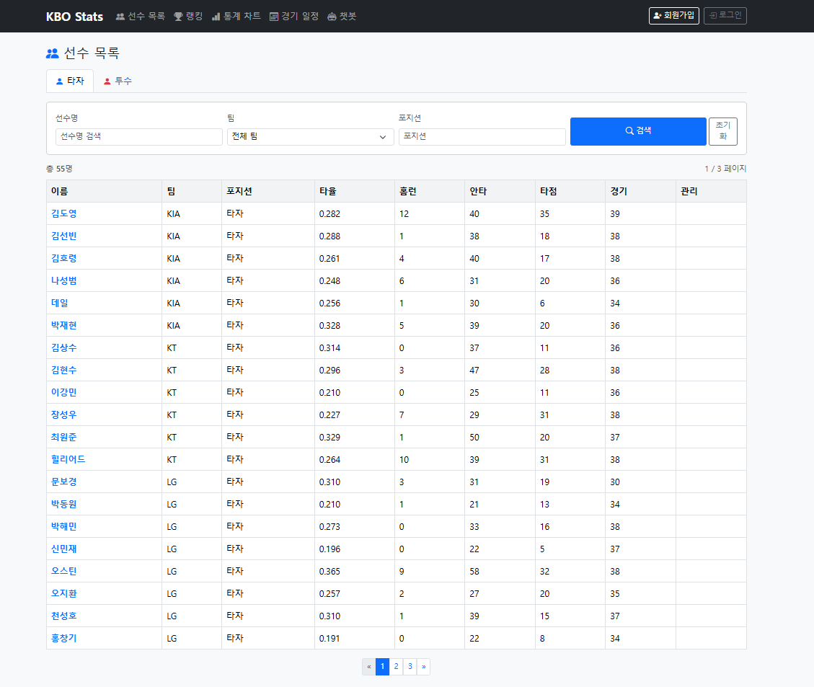
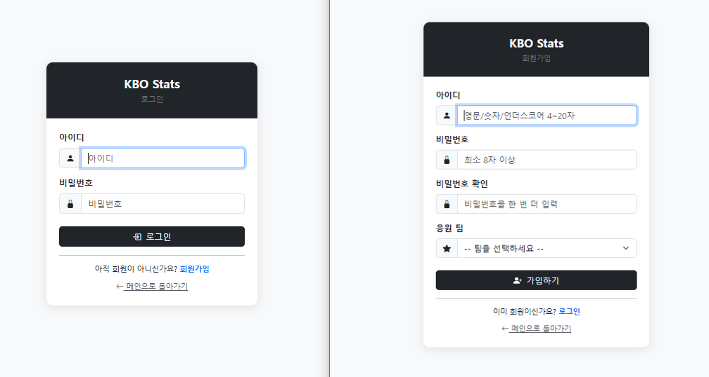
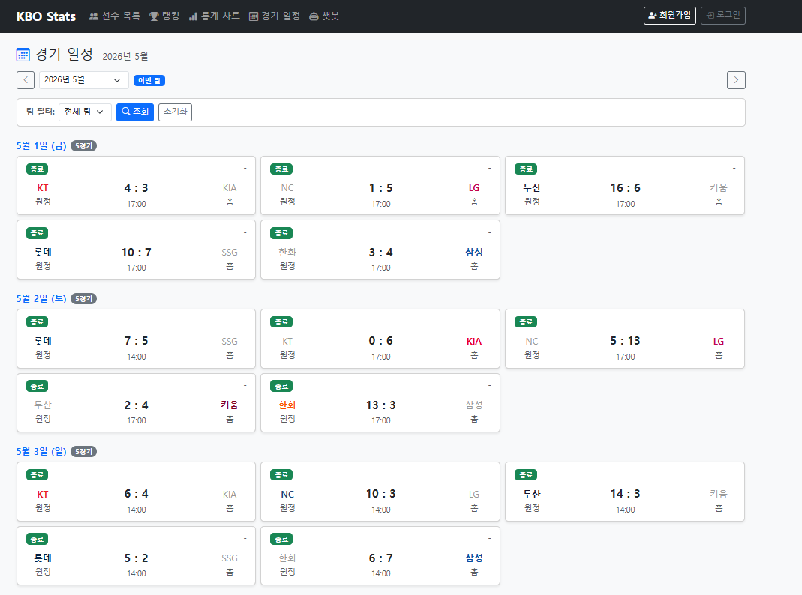
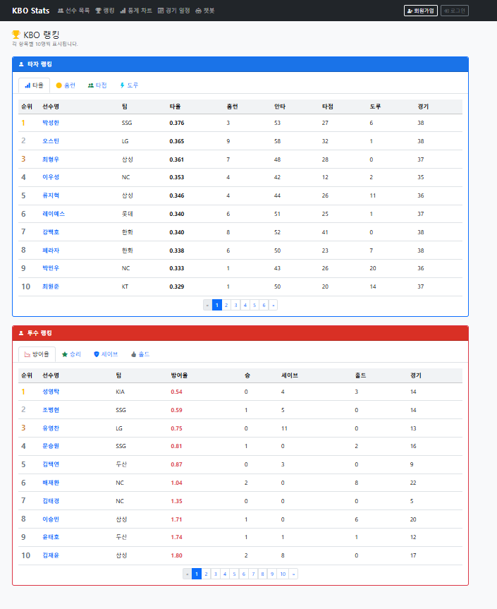
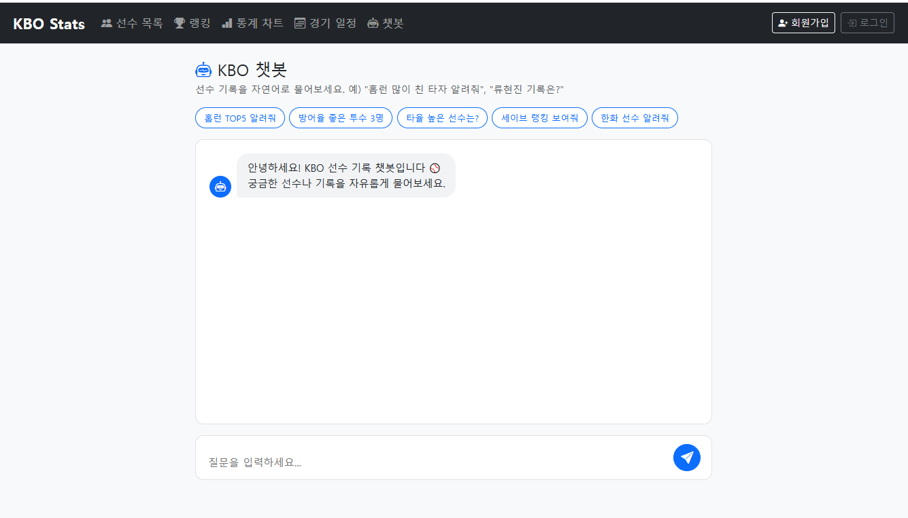

# ⚾ KBO 통계 시스템

KBO 리그의 선수 기록, 경기 일정/결과, 박스스코어, AI 챗봇 기능을 제공하는 웹 애플리케이션입니다.

🌐 **데모 사이트**: [http://43.200.221.146:8080](http://43.200.221.146:8080)  
⚾ **박스스코어 예시**: [5/16 LG@SSG 12회 연장](http://43.200.221.146:8080/games/11398)

> AWS EC2 (Ubuntu) + RDS MySQL로 배포

**핵심**: KBO 공식 사이트 크롤링 + 박스스코어 API 통합 + AI 챗봇(RAG). 시즌 685경기 + 216개 박스스코어 자동 적재.

## 📌 프로젝트 소개

KBO 공식 사이트에서 선수 기록과 경기 일정을 자동으로 수집해 보여주고, 회원가입한 사용자는 응원팀을 설정해 개인화된 일정 화면을 받을 수 있습니다. 박스스코어 API를 별도로 통합해 경기별 상세 데이터(이닝 점수, 타자/투수 출장 기록)도 제공하며, 박스스코어 누적 데이터와 시즌 통계를 교차 검증해 데이터 신뢰성을 모니터링합니다. Claude Haiku API 기반 챗봇으로 선수 기록을 자연어로 질문할 수 있고, 동일 질문 캐싱과 IP별 요청 제한으로 호출 비용을 관리합니다.

> 이 프로젝트는 **Claude Code(Anthropic의 AI 코딩 어시스턴트)와의 페어 프로그래밍**으로 개발했습니다. AI를 도구로 활용한 개발 방식과 그 과정에서의 의사결정은 [🤖 AI 협업 개발 방식](#-ai-협업-개발-방식) 섹션을 참고해주세요.

## 🛠 기술 스택

| 구분       | 기술                                      |
| ---------- | ----------------------------------------- |
| Backend    | Java 17, Spring Boot 3.x, Spring Security |
| DB         | MySQL 8.0, MyBatis                        |
| Crawling   | Selenium 4 (ChromeDriver), Jsoup          |
| External API | Spring WebFlux WebClient                |
| AI         | Anthropic Claude API (Haiku)              |
| Cache      | Caffeine, Spring Cache                    |
| Rate Limit | Bucket4j                                  |
| Frontend   | Thymeleaf, Bootstrap 5                    |
| API Docs   | SpringDoc OpenAPI (Swagger UI)            |
| Build      | Maven                                     |
| Dev Tool   | Claude Code (AI Pair Programming)         |
| etc        | Lombok, BCrypt                            |

## 📁 프로젝트 구조

```
src/main/java/com/kbo/stats/
├── KboStatsApplication.java           # 메인 애플리케이션
├── config/
│   ├── SecurityConfig.java            # Spring Security 설정
│   ├── CacheConfig.java               # Caffeine 캐시 설정
│   ├── RateLimitConfig.java           # Bucket4j Rate Limit 설정
│   └── OpenApiConfig.java             # Swagger 설정
├── controller/
│   ├── HomeController.java
│   ├── AuthController.java
│   ├── PlayerController.java
│   ├── GameController.java            # 경기 일정 + 박스스코어 상세 페이지
│   ├── ChatbotController.java
│   ├── CrawlingController.java        # 선수/검증 수동 트리거
│   ├── BoxScoreCrawlController.java   # 박스스코어 수집 endpoint
│   ├── GlobalExceptionHandler.java
│   └── api/
│       ├── PlayerApiController.java
│       └── GameApiController.java     # 경기 + 박스스코어 REST API
├── service/
│   ├── UserService.java
│   ├── CustomUserDetailsService.java
│   ├── PlayerService.java
│   ├── CrawlingService.java           # 선수 데이터 Selenium 크롤링
│   ├── GameService.java
│   ├── GameCrawler.java               # 경기 일정 Selenium 크롤링
│   ├── ChatbotService.java            # Claude API 호출 (RAG)
│   ├── BoxScoreCollectService.java    # 박스스코어 수집·영속
│   ├── BoxScoreCrawler.java           # 날짜별 일괄 수집
│   ├── GameDetailService.java         # 박스스코어 상세 조회 (Spring Cache)
│   └── BoxScoreCrossValidationService.java  # 박스스코어 ↔ 시즌 통계 교차 검증
├── scheduler/
│   ├── CrawlingScheduler.java         # 매일 23:00 선수 / 23:50 박스스코어
│   └── DailyCounterResetScheduler.java
├── external/kbo/
│   ├── KboBoxScoreApiClient.java      # KBO 박스스코어 API 클라이언트
│   └── KboResponseParser.java         # 응답 파서
├── mapper/
│   ├── UserAccountMapper.java
│   ├── PlayerMapper.java
│   ├── GameMapper.java
│   ├── GameBoxScoreMapper.java
│   ├── GameInningScoreMapper.java
│   ├── GameEventMapper.java
│   ├── GameBatterLogMapper.java
│   ├── GamePitcherLogMapper.java
│   └── StatValidationLogMapper.java
├── domain/
│   ├── User.java
│   ├── Player.java
│   ├── Game.java
│   ├── GameStatus.java
│   ├── GameBoxScore.java
│   ├── GameInningScore.java
│   ├── GameEvent.java
│   ├── GameBatterLog.java
│   └── GamePitcherLog.java
└── dto/
    ├── SignUpDto.java
    ├── ChatMessageDto.java
    ├── GameDetailDto.java
    ├── BatterBoxScoreAggregate.java
    └── PitcherBoxScoreAggregate.java
```

## 🗄 ERD

```
+------------------+      +------------------+      +------------------+
|   user_account   |      |      player      |      |       game       |
+------------------+      +------------------+      +------------------+
| id (PK)          |      | id (PK)          |      | id (PK)          |
| username (UNI)   |      | name             |      | game_date        |
| password         |      | team             |      | game_time        |
| favorite_team    |      | position         |      | away_team        |
| role             |      | back_number      |      | home_team        |
| created_at       |      | batting_avg      |      | away_score       |
+------------------+      | obp / slg        |      | home_score       |
                          | era              |      | status           |
                          | wins / losses    |      | stadium          |
                          | last_updated     |      | UNIQUE(date,     |
                          +------------------+      |   away, home)    |
                                                    +------------------+
```

### 테이블 설명

- **user_account**: 사용자 계정 (role: USER / ADMIN, favorite_team으로 응원팀 저장)
- **player**: 선수 기록 (KBO 공식 사이트에서 자동 수집)
- **game**: 경기 일정/결과 (status: SCHEDULED, FINISHED, POSTPONED, CANCELED 등)

### 박스스코어 도메인 (game 테이블에 1:N 관계, ON DELETE CASCADE)

- **game_boxscore**: 경기 메타 (관중수, 시작/종료 시간, 심판, 결승타)
- **game_inning_score**: 이닝별 점수 (경기 × 이닝 × 팀)
- **game_event**: 주요 이벤트 (홈런, 결승타, 심판 판정)
- **game_batter_log**: 타자 출장 기록 (타순, 포지션, 타수, 안타, 타점, 시즌 평균)
- **game_pitcher_log**: 투수 등판 기록 (등판 순서, 이닝 outs, 자책점, 시즌 ERA)

이닝은 outs 정수로 저장 (5⅔이닝 = 17 outs). BigDecimal 반올림 경계값 문제 회피.

**현재 적재량**: 선수 208명, 경기 일정 685건, 박스스코어 216경기, 검증 로그 668건

## ✨ 주요 기능

### 인증/권한

- Spring Security 기반 로그인/로그아웃 (CSRF 보호 적용)
- BCrypt 비밀번호 암호화
- ADMIN / USER / 익명 권한 분리
- 회원가입 시 응원팀 설정 (10개 구단 중 선택)
- 권한 부족 시 홈 리다이렉트 + 안내 메시지

### 선수 기록

- KBO 공식 사이트에서 타자/투수 기록 자동 수집
- 팀별/포지션별 랭킹 조회
- 통계 시각화 차트
- 매일 새벽 자동 갱신 스케줄러

### 경기 일정/결과

- KBO 공식 사이트 Selenium 크롤링 (시즌 전체 약 685건 수집)
- 드롭다운 폼 제출 구조 대응을 위한 Selenium `Select` 활용
- 월별 드롭다운으로 일정 조회
- 응원팀 자동 필터 (로그인 시 응원팀 경기 우선)
- 팀 대표색 표시 + 승패 강조 (승리팀 굵게, 패배팀 회색)
- 시점별 seriesId 동적 분기 (10월 이후 포스트시즌 자동 포함)
- 매일 새벽 4시 / 오후 11시 자동 갱신 스케줄러

### 경기 박스스코어

- KBO 박스스코어 API에서 경기별 상세 데이터 자동 수집 (이닝/이벤트/타자/투수)
- 5개 정규화 테이블 (1:N + ON DELETE CASCADE), `INSERT ON DUPLICATE KEY UPDATE` + `deleteByGameId`로 멱등 ETL
- Spring Cache(`@Cacheable`) + `@CacheEvict`로 GET 최적화 및 데이터 변경 시 자동 무효화
- Thymeleaf 페이지 + REST API 이중 노출 (동일 서비스 재사용)
- 시즌 전체 216경기 박스스코어 적재 + KBO 공식과 1:1 정합성 검증
- 박스스코어 ↔ 시즌 통계 교차 검증 서비스로 데이터 신뢰성 모니터링
- 매일 23:50 자동 수집 스케줄러

### AI 챗봇

- Anthropic Claude Haiku API 사용
- RAG 방식 - DB의 실제 선수 데이터를 컨텍스트로 전달해 환각(hallucination) 방지
- Caffeine 캐싱 - 동일 질문은 LLM 호출 없이 캐시 응답 (약 3초 → 0.1초 미만)
- Bucket4j Rate Limiting - IP별 분당 10회 / 일 500회 제한

## 💡 트러블슈팅

### 1. 크롤링 21초 → 13초 (39% 단축)

**문제**: Selenium 크롤러 페이지당 21초 소요. 매일 자동 실행이라 부담.

**원인**: Selenium이 이미지/CSS/폰트까지 다 다운로드. 실제 필요한 건 HTML 텍스트뿐.

**해결**: Chrome 옵션으로 이미지/CSS 로드 비활성화 + 페이지 소스를 Jsoup으로 파싱.

측정 → 분석 → 개선 → 재측정 사이클로 39% 단축.

### 2. ASP.NET 동적 페이지 크롤링

**문제**: KBO 일정 페이지가 URL의 `gameMonth` 파라미터를 무시하고 페이지 내 드롭다운(Form Submit)으로만 월 변경 가능.

**대안 검토**:

- 네이버 스포츠 우회 → React SPA의 빌드 해시 클래스명이 매번 바뀌어 안정성 부족
- Selenium `Select` 클래스로 드롭다운 직접 조작 → 채택

**해결**: ChromeDriver 1회 생성 후 드롭다운 값만 9번 변경. 3~9월 전체 30~40초.

```java
Select select = new Select(dropdown);
select.selectByValue(String.format("%02d", month));
```

### 3. 포스트시즌 placeholder 데이터

**문제**: `seriesId=0,9,6`으로 정규+포스트시즌 함께 호출하면 시즌 초반에 10/11월 잠정 매치업이 그대로 들어와 중복 저장.

**원인**: KBO가 아직 확정 안 된 포스트시즌 일정을 placeholder로 응답에 포함.

**해결**: 현재 날짜 기준 시리즈 ID 동적 분기. 3~9월은 정규시즌만, 10월 이후 포스트시즌 포함.

```java
return (LocalDate.now().getMonthValue() >= 10) ? "0,9,6" : "0";
```

시점만 되면 코드 수정 없이 자동으로 가을야구 일정이 채워짐.

### 4. AI 챗봇 비용 및 남용 방지

**문제**: Claude API 호출당 과금. 반복 질문 + 악의적 남용 시 비용 누적.

**해결**: 3중 방어

- **Caffeine 캐싱**: 동일 질문은 LLM 호출 없이 캐시 응답 (3초 → 0.1초 미만)
- **Bucket4j Rate Limiting**: IP별 분당 10회 / 일 500회 제한
- **RAG 패턴**: 의도 파악 후 DB 조회 → 실제 데이터를 컨텍스트로 전달, LLM이 추측 못하게 차단

### 5. KBO 박스스코어 API 4단 디버깅

**문제**: `.asmx` 엔드포인트 호출이 단계마다 다른 방식으로 실패.

**원인 4가지**:

- CSRF 누락이 `AccessDeniedException` 하위 예외로 분기되어 권한 거부 redirect로 위장
- `${ENV:default}` fallback의 default URL이 잘못 박혀 다른 사이트 호출
- KBO `.asmx`의 봇 차단 (Referer / User-Agent / X-Requested-With 검증)
- 응답 Content-Type이 `text/plain`인데 본문은 JSON (Spring Jackson 디코더 미스매치)

**해결**:

- SecurityConfig에 CSRF 예외 등록
- `application.yml`을 KBO 공식 endpoint로 수정
- WebClient `defaultHeader`에 브라우저 헤더 3종 추가
- `ExchangeStrategies`로 Jackson 디코더에 `text/plain` 미디어 타입 추가

```java
Jackson2JsonDecoder jsonDecoder = new Jackson2JsonDecoder(
        objectMapper,
        MediaType.APPLICATION_JSON,
        MediaType.TEXT_PLAIN);  // KBO API는 JSON을 text/plain으로 응답
```

응답 메시지 패턴(`200 OK + redirect`, `baseUrl + path` 합성형, 에러 페이지의 `<title>` 태그)을 단서로 한 단계씩 역추적.

### 6. 박스스코어 교차 검증으로 외부 데이터 비일관성 발견

**문제**: 박스스코어 누적 계산값과 KBO 시즌 통계의 일치율이 타율 33% / ERA 80% / WHIP 51%.

**추적 과정**:

- 1차 가설(수집 시점 차이) → 데이터 동기화 후에도 일치율 거의 동일, 가설 폐기
- 박재현(KIA) 사례: 박스스코어 40경기 42안타 vs KBO 시즌통계 40경기 47안타. 경기 수가 같은데 안타 5개 차이
- KBO 공식 박스스코어 페이지에서 박재현 5경기(4/30, 4/26, 4/16, 5/05, 5/02) 직접 대조 → 우리 DB와 100% 일치

**결론**: 차이는 우리 시스템이 아니라 KBO 박스스코어 페이지와 시즌 통계 페이지의 집계 차이. 검증 도구가 없었으면 못 발견했을 외부 데이터 소스의 한계.

검증 결과는 `stat_validation_log`에 누적 적재돼 시즌 내내 데이터 품질 변화를 추적할 수 있습니다.

## 🤖 AI 협업 개발 방식

Claude Code(Anthropic의 AI 코딩 어시스턴트)와 페어 프로그래밍으로 개발했습니다. 코드를 받아 그대로 붙여넣는 게 아니라 설계, 구현, 디버깅 사이클을 같이 돌리는 방식이었습니다.

### 활용 방식

요구사항을 정리해 Claude Code에 전달하고 초기 구현을 받은 다음, 프로젝트 컨벤션과 기존 코드 스타일에 맞춰 검토·수정. 디버깅할 때는 콘솔 로그와 에러 메시지를 직접 분석해 가설을 세운 뒤 AI와 함께 검증. 의사결정은 AI가 제시한 옵션 중 trade-off를 비교해 직접 선택했습니다.

### 직접 한 부분

외부 시스템 구조 분석은 결국 사람이 브라우저 개발자 도구를 열어야 했습니다. 네이버 SPA의 빌드 해시 클래스, KBO의 ASP.NET 드롭다운 동작, KBO `.asmx`의 봇 차단 헤더가 그렇습니다. 데이터 검증도 SQL 쿼리로 직접 이상 징후를 추적했습니다.

박스스코어 교차 검증이 대표적입니다. 일치율 33% 결과가 나왔을 때 AI가 처음 제시한 가설(시점 차이)을 데이터로 검증하고 그게 틀렸음을 확인한 다음, KBO 공식 사이트에서 5경기 1:1 대조까지 진행하면서 진짜 원인(외부 데이터 소스 비일관성)을 추적한 건 사람이 해야 하는 부분이었습니다.

### 느낀 점

AI 코드의 품질은 결국 입력 컨텍스트의 품질에 비례한다는 걸 여러 번 체감했습니다. 디버깅의 핵심인 가설 수립과 원인 추적은 결국 사람의 영역이었고, AI를 코드 생성기보다 페어 파트너로 활용할 때 효과가 가장 컸습니다.

## 📸 화면 미리보기

### 메인 화면



### 로그인 / 회원가입



### 경기 일정/결과



### 선수 랭킹



### AI 챗봇



## 🚀 실행 방법

### 1. 사전 요구사항

- Java 17
- MySQL 8.0
- Maven 3.8 이상
- Chrome 브라우저 (Selenium 크롤링용)

### 2. DB 설정

```sql
CREATE DATABASE kbo_stats DEFAULT CHARACTER SET utf8mb4;
USE kbo_stats;

CREATE TABLE user_account (
    id BIGINT AUTO_INCREMENT PRIMARY KEY,
    username VARCHAR(50) NOT NULL UNIQUE,
    password VARCHAR(100) NOT NULL,
    favorite_team VARCHAR(20),
    role VARCHAR(20) DEFAULT 'USER',
    created_at TIMESTAMP DEFAULT CURRENT_TIMESTAMP
);

CREATE TABLE game (
    id BIGINT AUTO_INCREMENT PRIMARY KEY,
    game_date DATE NOT NULL,
    game_time TIME,
    away_team VARCHAR(20) NOT NULL,
    home_team VARCHAR(20) NOT NULL,
    away_score INT,
    home_score INT,
    status VARCHAR(20) NOT NULL DEFAULT 'SCHEDULED',
    stadium VARCHAR(50),
    notes VARCHAR(200),
    created_at TIMESTAMP DEFAULT CURRENT_TIMESTAMP,
    updated_at TIMESTAMP DEFAULT CURRENT_TIMESTAMP ON UPDATE CURRENT_TIMESTAMP,
    UNIQUE KEY uk_game (game_date, away_team, home_team),
    INDEX idx_game_date (game_date),
    INDEX idx_game_status (status)
);

-- player 테이블 및 박스스코어 5개 테이블
-- (game_boxscore, game_inning_score, game_event, game_batter_log, game_pitcher_log)
-- 및 stat_validation_log는 schema.sql 참고
```

### 3. 환경변수 설정

`src/main/resources/application-local.yml` 파일을 생성하고 아래 값을 입력하세요:

```yaml
spring:
  datasource:
    url: jdbc:mysql://localhost:3306/kbo_stats?serverTimezone=Asia/Seoul
    username: your_username
    password: your_password

anthropic:
  api-key: YOUR_CLAUDE_API_KEY

admin:
  username: admin
  password: YOUR_ADMIN_PASSWORD
```

> ⚠️ 이 파일은 `.gitignore`에 등록되어 있어 Git에 올라가지 않습니다.

### 4. 실행

```bash
./mvnw spring-boot:run
```

브라우저에서 `http://localhost:8080` 접속  
API 문서는 `http://localhost:8080/swagger-ui.html`에서 확인할 수 있습니다.

## 📡 REST API

| Method | URL                              | 설명                             | 권한  |
| ------ | -------------------------------- | -------------------------------- | ----- |
| GET    | /api/v1/players                  | 선수 목록 조회                   | 모두  |
| GET    | /api/v1/players/{id}             | 선수 상세 조회                   | 모두  |
| POST   | /api/v1/players                  | 선수 등록                        | ADMIN |
| PUT    | /api/v1/players/{id}             | 선수 수정                        | ADMIN |
| DELETE | /api/v1/players/{id}             | 선수 삭제                        | ADMIN |
| GET    | /api/v1/games?from=&to=          | 경기 일정 조회                   | 모두  |
| GET    | /api/v1/games/{id}               | 경기 상세 조회                   | 모두  |
| GET    | /api/v1/games/{id}/detail        | 경기 상세 + 박스스코어 조회      | 모두  |
| POST   | /games/crawl                     | 경기 데이터 갱신                 | ADMIN |
| POST   | /players/crawl                   | 선수 데이터 갱신                 | ADMIN |
| POST   | /crawling/boxscore?gameId={id}   | 단일 경기 박스스코어 수집        | ADMIN |
| POST   | /crawling/boxscore?date=YYYYMMDD | 날짜별 박스스코어 일괄 수집      | ADMIN |
| POST   | /crawling/cross-validation       | 박스스코어 ↔ 시즌 통계 교차 검증 | ADMIN |
| POST   | /api/v1/chatbot                  | 챗봇 질의                        | 모두  |
| POST   | /signup                          | 회원가입                         | 익명  |
| GET    | /my/profile                      | 마이페이지                       | USER  |
| POST   | /my/team                         | 응원팀 변경                      | USER  |
